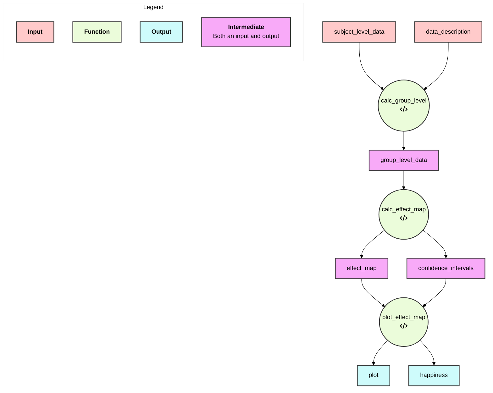

```mermaid
 %%{init: {'theme':'base', 'themeVariables': {
  'primaryColor': '#ffcaca',
  'primaryTextColor': '#000',
  'primaryBorderColor': '#000000',
  'lineColor': '#000000',
  'tertiaryColor': '#fff'
}}}%%
graph TD
classDef lightRed fill:#ffcaca,stroke:#333,stroke-width:2px;
classDef lightGreen fill:#ebfcda,stroke:#333,stroke-width:2px;
classDef lightBlue fill:#cefbfb,stroke:#333,stroke-width:2px;
classDef lightPurple fill:#f8aaf8,stroke:#333,stroke-width:2px;

subgraph Legend
    direction TB
    key1[<b>Input]:::lightRed
    key2[<b>Function]:::lightGreen
    key3[<b>Output]:::lightBlue
    key4[<b>Intermediate</b><br> Both an input and output]:::lightPurple
end
calc_group_level(("calc_group_level")):::lightGreen
calc_group_level(("calc_group_level
 fa:fa-code"))
subject_level_data:::lightRed
subject_level_data --> calc_group_level
data_description:::lightRed
data_description --> calc_group_level
group_level_data:::lightBlue
calc_group_level --> group_level_data
calc_effect_map(("calc_effect_map")):::lightGreen
calc_effect_map(("calc_effect_map
 fa:fa-code"))
group_level_data --> calc_effect_map
effect_map:::lightBlue
calc_effect_map --> effect_map
confidence_intervals:::lightBlue
calc_effect_map --> confidence_intervals
plot_effect_map(("plot_effect_map")):::lightGreen
plot_effect_map(("plot_effect_map
 fa:fa-code"))
effect_map --> plot_effect_map
confidence_intervals --> plot_effect_map
plot:::lightBlue
plot_effect_map --> plot
happiness:::lightBlue
plot_effect_map --> happiness
subject_level_data:::lightRed
data_description:::lightRed
group_level_data:::lightPurple
effect_map:::lightPurple
confidence_intervals:::lightPurple
plot:::lightBlue
happiness:::lightBlue
```